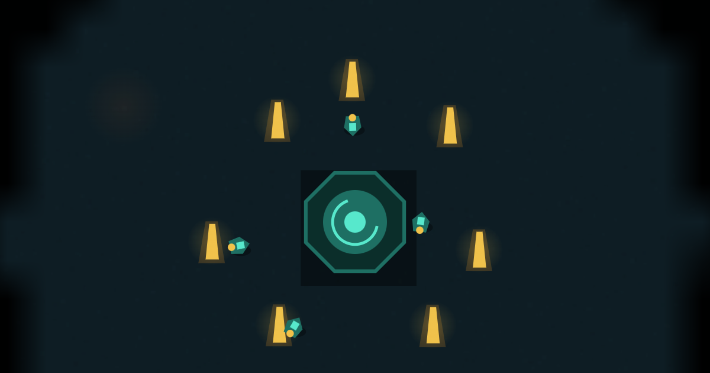

# VENTFALL — Ashes of the Deep

**[▶ Play it now](https://protonmatter.github.io/ventfall/)** — nothing to install.

A real-time strategy game with a full narrative campaign, in one HTML file. No
build step, no dependencies, no network calls — fonts embedded, fully offline.
All graphics are drawn procedurally to canvas (2.5D: textured strata, extruded
lit terrain and structures, marine-snow parallax); audio plays from the repo's
own pre-rendered sound pack when served over HTTP and falls back to live Web
Audio synthesis when opened from disk.

## The campaign

**Ashes of the Deep** — nine chapters in three acts across the Pacific trench
system, played through in-engine letterboxed cutscenes with a procedurally
drawn cast: Commander Voss, Chief Okafor, Director Krane, Dr. Sable, Captain
Reyne, and the Choir.

Act I is the Consortium's ocean — conquest, quotas, and the hubris that ends in
the Ventfall Cascade. Act II is the long dark: evacuating a dying field,
gleaning the wreck-lands, defending refugees. Act III is what the floor
remembers: first contact with something living in the vents, and the assault on
Krane's dreadnought rig.

Eight major decisions shape a unity/dominion ledger and persistent flags — you
can spare or strip a rival's survivors, defy or sign the quota, decide who
holds the corridor at Ashfall (a beloved character can die there and stays dead
in every later scene), forge an alliance or absorb a fleet, attune to the Choir
or harvest it, and pass judgment on Krane. **Four endings**: Dawn Under
Pressure, The Iron Tide, Gilded Rust, Embers Carried.

Between missions, spend battlefield salvage on six persistent upgrades. Saves
work at both levels: the campaign autosaves between maps, and the pause menu
(`F`) holds three full in-map save slots that capture the entire battlefield —
units, fog, objectives, research in flight.

Free Play (the classic single-map skirmish against the full AI, three
difficulties) is still on the title screen.



## Play

[protonmatter.github.io/ventfall](https://protonmatter.github.io/ventfall/), or
open `index.html` in any modern browser. That's the whole install.

Or serve it locally (enables the pre-rendered audio pack):

```bash
python3 -m http.server 8000
# http://localhost:8000
```

Three difficulties on the title screen — Calm Vent, Standard, Black Smoker —
set the opponent's wave size, growth, and timing. Your choice is remembered.

## Controls

| Input | Action |
|---|---|
| Drag | Box-select units |
| Click | Select one unit or structure |
| Double-click | Select all of that type on screen |
| Right click | Move · attack · mine · build (context-sensitive) |
| `Shift`+Right click | Queue a waypoint |
| `W` `A` `S` `D` / Arrows | Pan the field (screen edges also pan) |
| Mouse wheel | Zoom |
| `Q` | Attack-move |
| `E` | Stop |
| `F` | Pause (also auto-pauses when the tab is hidden) |
| `` ` `` | Select entire army |
| `Ctrl`+`1`–`9` | Assign control group |
| `1`–`9` | Recall control group (double-tap to center camera) |
| `Space` | Snap camera to your Rig Core |
| `Esc` | Cancel pending order |
| `V` `B` `N` `K` | Build Habitat · Foundry · Turret · Deepworks |
| `D` `L` `G` `R` `M` `Y` | Train from the selected structure |
| `P` `O` `U` | Research Plating · Optics · Servos |

With a production structure selected, right-click sets its rally point (drawn as
a flag) and clicking a queue cell cancels that unit for a full refund. Right-click
the sonar to order the selection from the minimap. The topbar has volume, mute,
pause, restart, and an idle-drone counter that cycles idle workers when clicked.

**Touch:** tap to select, drag for a selection box, tap open ground to order,
long-press for attack-move, two-finger drag to pan, pinch to zoom.

## Tech tree

```
Rig Core ──> Foundry ──> Deepworks
   │            │             │
 Drone      Lancer        Ripper
            Gunner        Mortar
                          Tender
                          + upgrades
```

### Units

| Unit | Cost | Crew | Role |
|---|---|---|---|
| Drone | 50 | 1 | Harvests ore, constructs buildings |
| Lancer | 75 | 2 | Cheap melee line |
| Gunner | 110 | 2 | Ranged support, 135 range |
| **Ripper** | 150 | 3 | Shock brawler. **Armor 3** subtracts from every hit, so it beats rapid small-arms fire and loses to splash |
| **Mortar** | 185 | 3 | Siege. 230 range, 46px splash, but a **70px minimum range** — it cannot defend itself and needs a screen |
| **Tender** | 120 | 2 | Repairs the most-wounded friendly in range; follows the army when idle |

### Structures

| Structure | Cost | Notes |
|---|---|---|
| Rig Core | — | Ore dropoff, trains Drones, +8 crew |
| Habitat | 100 | +8 crew |
| Foundry | 150 | Trains Lancer, Gunner |
| Turret | 125 | Automated defense, 170 range |
| Deepworks | 275 | Requires Foundry. Tier II units + upgrades |

### Upgrades

Team-wide, researched at the Deepworks, one at a time. If the researching
Deepworks is destroyed, the project moves to another Deepworks — or refunds
if you have none.

| Upgrade | Cost | Effect |
|---|---|---|
| Ablative Plating | 150 | +25% integrity (rescales existing units, preserving damage %) |
| Pressure Optics | 175 | +18% weapon range (turrets included) |
| Servo Drives | 140 | +20% movement speed |

## Opponent

The AI runs a full economy: it expands drone count, builds Habitats against its own
supply cap, adds Foundries, techs to a Deepworks, fields a mixed composition
(Tender first, then Mortars, then Rippers), researches upgrades, and escalates
attack waves on a timer with a cooldown between pushes. It is not scripted —
it plays by the same core rules you do, with two stated asymmetries: it sees the
whole map (no fog for the AI), and on Black Smoker it receives a small ore trickle.

On Standard, a passive player loses around 2:40. An engaged opening survives well
past that. Career stats — games, wins, fastest clear — persist in your browser
and show on the shift report.

## Audio

`audio/` holds 32 original sound effects in WAV (44.1 kHz / 16-bit mono) and MP3
(192 kbps), plus `synth.py` that generates them. Every sample is synthesized from
oscillators and filtered noise — no sampled, recorded, or third-party audio at any
stage. See `audio/AUDIO.md`.

When the game is served over HTTP it plays the MP3 renders directly (fetched and
decoded through one master gain with per-cue throttling). Opened from `file://`
or offline, every cue falls back to an equivalent live-synthesized version, so
the single file remains a complete game. The pack is also CC0 for reuse in your
own projects.

## Project layout

```
index.html        the entire game
audio/wav/        32 effects, WAV
audio/mp3/        32 effects, MP3 (loaded by the game when served)
audio/synth.py    regenerates the pack
audio/AUDIO.md    per-file reference and integration notes
docs/             implementation notes + screenshot
```

## License

MIT for the code, CC0 for the audio. See `LICENSE`.

All content is original. Nothing here is derived from any existing game's assets.
